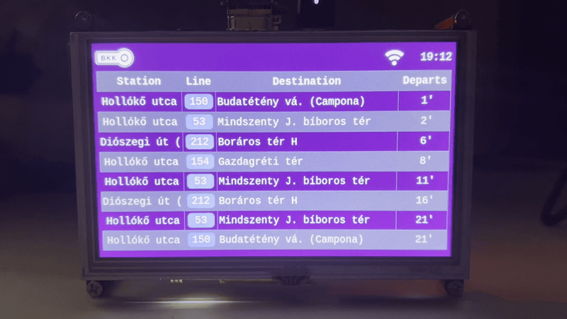
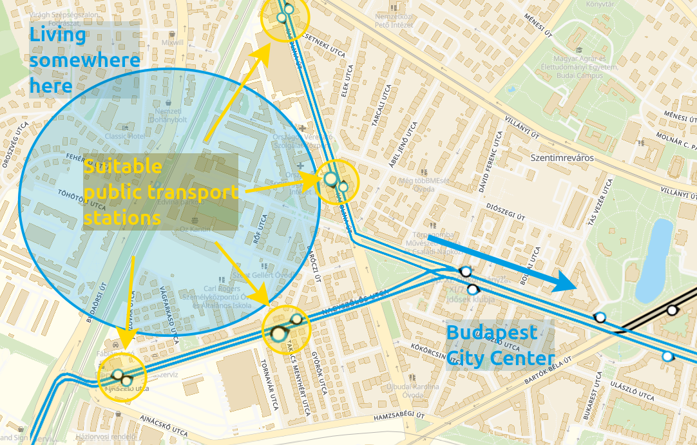
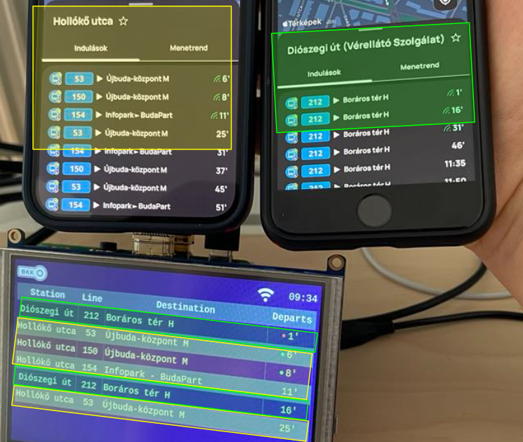
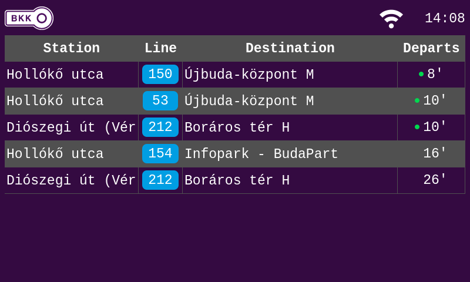
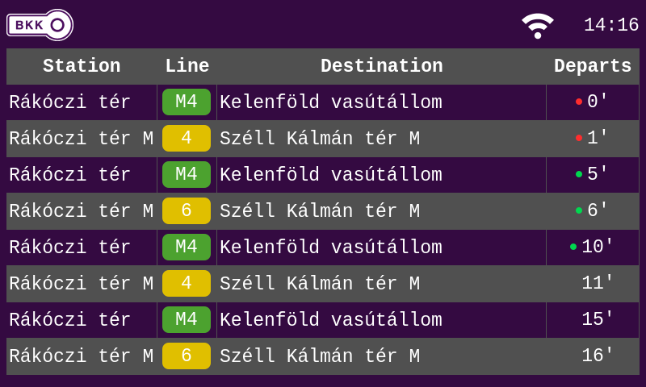
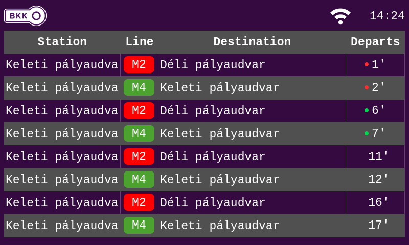

<p align="center">
    
    <p align="center">Routes from "Diószegi út (Vérellátó szolgálat)" and "Hollókő utca" to the city center.</p>
</p>

# BKK Display

BKK Display is a Yocto-based project that uses a custom BKK API submodule to fetch real-time public transport data from the Budapest Public Transport Center’s key-accessed server. With a Qt-powered UI, it lets you display and configure arrival times for selected stations, offering a simple and personalized solution for commuting.

## Motivation

Living in Budapest, I have multiple bus stations near my home, each in opposite directions from my apartment. These stations provide me with options for getting into the city for work, socializing with friends, or running daily tasks. However, I often need a quick way to decide which station to use, depending on the buses’ real-time schedules. This little project was born out of this daily question, and it’s made life just a bit smoother.

<p align="center">
    
    <p align="center">A map illustrating the two lines and the stations I frequently use.</p>
</p>

Although, there is a feature in the official BudapestGO application to show nearby stations, but it displays every arrivals for every nearby stations, and I found it sometimes confusing and chaotic. It displays lines and stations you don't care about, but the BKK Display can be configured to meet your needs. 

<p align="center">
    
</p>

## Architecture

BKK Display is split into several small services and libraries, each responsible
for one part of the system. Yocto integrates these components into a custom
Raspberry Pi Linux image.

                  BKK API
                     │
                     ▼
                 bkk-api
                     │
                     ▼
              display services
          ┌──────────┼──────────┐
          ▼          ▼          ▼
     main-content  info-bar  screen-owner
          │          │          │
          └──────────┴──────────┘
                     │
                     ▼
                    Qt
                     │
                     ▼
                  Display

Configuration / supporting services:
    Web Setup Helper - Network Manager
    rbuflogd        - Logging
    bkk-tee         - Secure storage / OP-TEE


### BKK API

Interface responsible for retrieving real-time arrival information from the
Budapest public transport API. It hides the HTTP/API handling from the display
applications.

[More info →](https://github.com/danielpapa1166/bkk_api)

### Display subsystem

The UI is split into several processes with separate responsibilities:

- **bkk-screen-owner** - owns and coordinates the physical display - [detailed documentation →](meta-bkk-display/recipes-app/bkk-screen-owner/readme.md)
- **bkk-screen-main-content** - renders the real-time public transport information - [detailed documentation →](meta-bkk-display/recipes-app/bkk-screen-main-content/readme.md)
- **bkk-screen-info-bar** - renders auxiliary/status information - [detailed documentation →](meta-bkk-display/recipes-app/bkk-screen-info-bar/readme.md)
- **ads7846-controller** - Provides the interface to the ADS7846 touchscreen controller and handles touchscreen input. It is also used as part of the display **power-saving mechanism**: after a configurable period of inactivity, the display enters power-save mode and is woken up when touchscreen activity is detected: i.e. you poke the screen.

### Configuration and networking

The Network Manager hosts a wireless Access Point during the first boot to allow the user to configure a wifi connection. Once it is done, the Network Manager switches to the configured network putting the device on line. 

[Detailed documentation →](meta-bkk-display/recipes-app/network-manager/readme.md)

### Secure storage

`bkk-tee` integrates [OP-TEE](https://optee.readthedocs.io/en/latest/general/about.html) and provides secure storage for sensitive
configuration such as API credentials.

[Detailed documentation →](meta-bkk-display/recipes-app/bkk-tee/readme.md)

### Logging

`rbuflogd` provides centralized runtime logging for the different application
processes.

[Detailed documentation →](https://github.com/danielpapa1166/rbuflogd)

### Qt integration

The `meta-Qt` Yocto layer contains all Qt-specific build configuration. Qt is
configured for direct embedded rendering using EGLFS/KMS/GBM/LinuxFB without
requiring X11.

[Detailed documentation →](meta-Qt/README.md)

### Yocto integration

`meta-bkk-display` contains the application recipes, image configuration,
kernel/platform customization and the integration required to build the final
Raspberry Pi image.

`meta-platform-config` contains reusable platform configuration shared with
other Yocto projects.


## Getting started

### BOM 
- Raspberry Pi 4 
- [Display module](https://www.hestore.hu/prod_10046543.html?gross_price_view=1&source=gads&lang=hu&gad_source=1&gad_campaignid=17335669125&gbraid=0AAAAADz0y9LVUEhlznxppAJWXKHilyrkG&gclid=Cj0KCQjwk5nVBhDiARIsAHNGqadvKVvL6vDfL0_QVgMGo0ljST20p6xY2t_oxsik3DbWBf1SVzOLGsEaAvIQEALw_wcB)
- SD card 

## Build and flash

The project is built as a complete embedded Linux image using the **Yocto Project**. It extends Yocto's `core-image-full-cmdline` image with the BKK Display applications, services, and platform configuration.

After setting up the Yocto build environment, build the image with:

```bash
source poky/oe-init-build-env
bitbake core-image-full-cmdline
```

The generated `.wic` image can be found under:

```text
tmp/deploy/images/<machine>/
```

Flash the image to an SD card using a tool such as **Raspberry Pi Imager**, `bmaptool`, or `dd`. Insert the SD card into the Raspberry Pi and boot the device; the required BKK Display services are included in the image and started automatically.


### User config 
#### Network Configuration 
On first boot, the device creates a Wi-Fi access point through which the network credentials can be configured using a web interface available at `192.168.4.1:8080.`

To simplify the setup process, the Display shows QR codes for connecting to the access point and opening the configuration interface. The QR codes are generated at runtime using [this module](https://github.com/danielpapa1166/qr_code_gen).

<p align="center">
    
    <p align="center">Connect to the Access Point using the QR code</p>
</p>

<p align="center">
    
    <p align="center">Web interface to provide wifi credentials</p>
</p>


#### BKK API configuration

After the network connection has been configured, the BKK API key and the list of stations to be displayed can be provided through the web interface.
An API key can be requested from the official [BKK](https://opendata.bkk.hu/keys) website. 

<p align="center">
    
    <p align="center">Configure the API in your browser.</p>
</p>

#### Normal operation 
<p align="center">
    
    <p align="center">HW setup during normal operation</p>
</p>

During normal operation, the display shows real-time arrival information for the configured stations and indicates any errors that may prevent the arrival data from being retrieved or displayed.

#### Screenshots 

<p align="center">
    
    <p align="center">Bus Lines presented on the map above.</p>
</p>

<p align="center">
    
    <p align="center">Tram 4-6 and M4 departures from Rákóczi tér</p>
</p>

<p align="center">
    
    <p align="center">M2 and M4 departures from Keleti Pályaudvar</p>
</p>


## Disclaimer / Project scope

This is a **hobby project** developed primarily for learning and experimenting with embedded Linux technologies. Some parts of the system are intentionally over-engineered for the relatively simple task they perform, with the goal of exploring technologies, architectural patterns, and lower-level system concepts that would not necessarily be required in a production implementation.

The project is under active development and may contain known limitations or bugs. See the [open GitHub issues](https://github.com/danielpapa1166/bkk_display/issues) for currently known issues and planned improvements.
